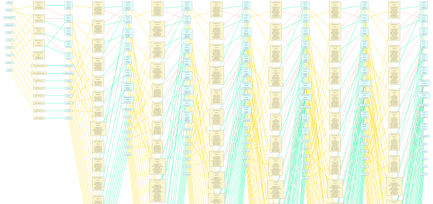

# EighthBridge

*Interactive graph modeling and rendering for ScalaFX*


## Introduction




EighthBridge is a ScalaFX library dedicated to:

* **graph modeling**, via its *Graph* and *GraphComponent* traits

* **graph interactive rendering**, via a ScalaFX component named *GraphCanvas* and the related classes and traits - in particular, *VisualGraph*. Graphs are rendered in JavaFX, letting the developer choose how users can interact with every element


EighthBridge stems from both the old *Arcontes* library (introduced to support a previous version of GraphsJ) and my experience with the [Elm](http://elm-lang.org/) language - which I studied while creating my first HTML 5 videogame - [Solvenius](http://gianlucacosta.info/solvenius/).

In particular, EighthBridge's most important aspect is that *the graph model is immutable* - adding a vertex, for example, creates a new graph.

Such solution, derived from *purely functional programming*, definitely increased the conciseness, simplicity and robustness of the model, dramatically speeding up development.

Mutability is still present where more natural and sometimes almost required - in the ScalaFX components - making EighthBridge *a hybrid OOP-functional library*, perfectly supported by Scala's hybrid, very elegant nature.

To further focus on the declarative nature of EighthBridge, graphs must be *skinned* using standard *JavaFX CSS stylesheets* (see below).


## Requirements

Scala 2.11.8 or later and Java 8u91 or later are recommended to employ EighthBridge.


## Referencing the library

EighthBridge is available on [Hephaestus](https://bintray.com/giancosta86/Hephaestus) and can be declared as a Gradle or Maven dependency; please refer to [its dedicated page](https://bintray.com/giancosta86/Hephaestus/EighthBridge).

Alternatively, you could download the JAR file from Hephaestus and manually add it to your project structure.

Finally, EighthBridge is also a standard [OSGi](http://www.slideshare.net/giancosta86/introduction-to-osgi-56290394) bundle which you can employ in your OSGi architectures! ^\_\_^


## Core concepts

EighthBridge is designed to be simple and minimalist; however, we could now go through a brief overview of the most important traits and classes:

* **Graph** is the fundamental trait underlying the whole library, and is *immutable*: its methods are either query functions or operations creating a new graph instance

* **Vertex**: trait modeling a generic vertex. Immutable.

* **Link**: trait modeling a generic. Immutable.

* **Binding**: since vertexes and links are immutable and exist a-priori, how to join them? Via a *Binding* object, which represents the juncture between a link and a collection of vertexes. The provided implementations are **EdgeBinding** and **ArcBinding**, for point-to-point connections. Bindings are immutable, too.

* **GraphComponent**: the trait shared by vertexes, links and bindings - it provides a unique UUID to identify each component

* **DirectedGraph**: trait providing utility functions for graphs based on **ArcBinding**

* **VisualGraph**: the most important *DirectedGraph* subtrait, which is widely employed both in the rendering subsystem and in other projects - such as [GraphsJ](https://github.com/giancosta86/GraphsJ): its vertexes and links inherit from **VisualVertex** and **VisualLink**. Bindings for a visual graph are always **ArcBinding**'s - because when you draw a graph you implicitly work with arcs; however, it can easily be interpreted as an undirected graph, as shown in [Prim's Shortest Spanning Tree implementation](https://github.com/giancosta86/GraphsJ-scenarios).

* **GraphCanvas**: the core ScalaFX component for interactive rendering. On construction, it requires a **GraphCanvasController** - telling how to draw graph components as JavaFX nodes and how to handle user interactions - as well as an initial *VisualGraph*, which gets replaced by new instances as the controller provides them in response to the user.

* **DefaultVisualGraph**, **DefaultVisualVertex** and **DefaultVisualLink** are default implementations of the visual traits - each having a related **.*Settings** case class to describe its visual appearance.

* **fx.canvas.basic** is a very important package providing default implementations of the ScalaFX nodes for rendering graph components, as well as **BasicController**, a fine-grained controller employed by such components to control user interaction.

* **fx.canvas.basic.editing** is a package containing the utility trait **InteractiveEditingController** and its sub-traits

For further information, a basic documentation can be found in its Scaladoc, which can be downloaded from the library's [section in Hephaestus](https://bintray.com/giancosta86/Hephaestus/EighthBridge). Finally, the full open source code is available on GitHub.


## Enhanced graph interaction

Starting from version 3, EighthBridge automatically provides interactive features very similar to map navigation:

* **panning**: by pressing *CTRL* while clicking on a graph canvas, the user can drag the whole graph canvas (provided that **panEnabled** on **GraphCanvas** was true - the default)

* **zooming**: by using the mouse wheel, the user can zoom in and out, if **zoomEnabled** is true - the default. Additional properties - **minZoomScale** and **maxZoomScale** - allow fine-grained control.


## Styling graphs with CSS

Starting from EighthBridge 2, the visual properties (fonts, colors) of graphs, vertexes and links are to be declared in standard *JavaFX CSS* files.

**PLEASE, NOTE**: CSS styling is *mandatory*, not optional: if you forget to add CSS declarations for your graphs, GraphCanvas will only show a black rectangle.

**To include the default CSS stylesheet**, providing very sensible (and overridable) defaults, just add this line of code to the initialization of any scene using EighthBridge:

```scala
scene.getStylesheets.addAll(
  BasicStyles.resourceUrl.toExternalForm,

  //Your additional CSS resources, if any
)
```

### The CSS tree for the "basic" package

To create your own CSS files that customize the visual appearance of the renderers provided by the **basic** package, please use the following CSS selectors:

* **.graphCanvas** - a GraphCanvas control

* **.graph** - a BasicBackgroundNode

* **.graph > .backgroundRectangle** - the rectangle used as the background of the graph

* **.graph > .selectionRectangle** - the selection rectangle

* **.vertex** - a BasicVertexNode

* **.vertex > .body** - the rectangle used as the vertex body

* **.vertex > .label** - the vertex label

* **.link** - a BasicLinkNode

* **.link .line** - any line making up a link - including both the link body and its arrow

* **.link > .arrow** - the arrow of a link

* **.link > .arrow > .line** - the lines of a link arrow

* **.link > .label** - the label of a link

* **.link > .labelConnector** - the line connecting a link label and its link

* **.link > .internalPointHandle** - the point joining 2 consecutive segments of a link


**PLEASE, NOTE**: **VisualVertex** and **VisualLink** also have a **styleClasses** property, whose values are **appended** to the default class for the renderer (**.vertex** and **.link**, respectively). In other words, if you assign a vertex a styleClass named **solution**, you can style its label using this selector:

> .solution > .label


## About the name

The name *EighthBridge* derives from the famous [problem of the 7 bridges of Königsberg](https://en.wikipedia.org/wiki/Seven_Bridges_of_K%C3%B6nigsberg), negatively solved by Leonhard Euler: more precisely, the famous mathematician introduced the concept of *graph* to demonstrate that the problem had no solution; however, the problem can be positively solved if, for example, we think out of the box and introduce... a suitable eighth bridge! ^\_\_^


## Further references

* [Facebook page](https://www.facebook.com/EighthBridge-190637781313301)

* [GraphsJ](https://github.com/giancosta86/GraphsJ)

* [Helios-core](https://github.com/giancosta86/Helios-core)

* [Scala](http://scala-lang.org/)

* [ScalaFX](http://scalafx.org/)

* [Elm](http://elm-lang.org/)
